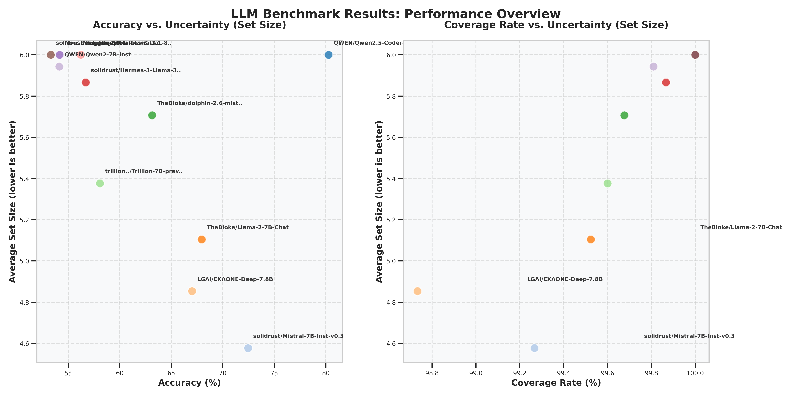

# LLM Uncertainty Benchmark

A comprehensive benchmarking framework for evaluating Large Language Models (LLMs) using uncertainty quantification, based on the paper ["Benchmarking LLMs via Uncertainty Quantification"](https://arxiv.org/abs/2401.12794).

## Overview

Traditional LLM benchmarks typically focus solely on accuracy metrics. This framework extends LLM evaluation by incorporating uncertainty quantification using conformal prediction, providing a more comprehensive assessment of model performance.

The benchmark evaluates LLMs on 5 core NLP tasks:
1. **Question Answering (QA)** - MMLU dataset
2. **Reading Comprehension (RC)** - CosmosQA dataset
3. **Commonsense Inference (CI)** - HellaSwag dataset
4. **Dialogue Response Selection (DRS)** - HaluEval dataset
5. **Document Summarization (DS)** - HaluEval dataset

Each task is formulated as a multiple-choice question with 6 options (A-F), with the last two options being "I don't know" and "None of the above".

## Key Metrics

The benchmark provides three key metrics for each model:

- **Accuracy (Acc)**: Traditional accuracy measure - percentage of questions answered correctly
- **Coverage Rate (CR)**: Percentage of test instances where the true label is in the prediction set
- **Set Size (SS)**: Average size of the prediction sets - a measure of model uncertainty (smaller is better)

## Features

- Evaluate LLMs using conformal prediction for uncertainty quantification
- Support for both base and instruction-tuned models
- Multiple prompting strategies for robust evaluation
- Comprehensive reporting and visualization tools
- Analysis capabilities for model scaling and instruction tuning effects
- **NEW: Parallel processing for high-throughput evaluation**

## Installation

```bash
# Clone the repository
git clone https://github.com/yourusername/llm-uncertainty-benchmark.git
cd llm-uncertainty-benchmark

# Optionally create a virtualenv to isolate dependencies
mkdir -p ~/venvs
python -m venv ~/venvs/uncertainty-benchmark
source  ~/venvs/uncertainty-benchmark/bin/activate

# Install required packages
pip install -r requirements.txt
```

The parallel implementation requires additional dependencies:
```bash
pip install aiohttp
```

## Usage

### Basic Model Evaluation

```python
from main import LLMUncertaintyBenchmark

# Initialize the benchmark
benchmark = LLMUncertaintyBenchmark(
    api_base_url="http://localhost:8000/v1",  # Your vLLM-OpenAI server endpoint
    api_key=None,  # API key if required
    calibration_ratio=0.5,  # Ratio of data to use for calibration
    error_rate=0.1  # Error rate alpha for conformal prediction
)

# Prepare datasets for all tasks
benchmark.prepare_datasets()

# Evaluate a model
benchmark.evaluate_model(
    model_name="meta-llama/Llama-2-13b-hf",
    use_chat_template=False,  # Set to True for instruction-tuned models
    prompt_strategies=["base", "shared_instruction", "task_specific"]
)

# Generate report
report = benchmark.generate_report()
print(report)

# Visualize results
benchmark.visualize_results()

# Save results
benchmark.save_results("./results/llama-2-13b")
```

### Command-line Interface

The package provides several command-line interfaces for common benchmarking scenarios:

#### Standard Sequential Benchmarking

```bash
# Benchmark a single model
python examples.py --api-base http://localhost:8000/v1 single --model meta-llama/Llama-2-13b-hf

# Compare multiple models
python examples.py --api-base http://localhost:8000/v1 compare --models meta-llama/Llama-2-7b-hf meta-llama/Llama-2-13b-hf

# Analyze effect of model scale
python examples.py --api-base http://localhost:8000/v1 scale --family meta-llama/Llama-2 --sizes 7b 13b 70b

# Analyze effect of instruction tuning
python examples.py --api-base http://localhost:8000/v1 instruct --family meta-llama/Llama-2 --sizes 7b 13b
```

#### High-Performance Parallel Benchmarking (NEW)

For faster evaluation using parallel processing:

```bash
# Benchmark a single model with parallel processing
python examples_parallel.py --api-base http://localhost:8000/v1 \
  --batch-size 20 --max-workers 8 \
  single --model meta-llama/Llama-2-13b-hf

# Compare multiple models with parallel processing
python examples_parallel.py --api-base http://localhost:8000/v1 \
  --batch-size 20 --max-workers 8 \
  compare --models meta-llama/Llama-2-7b-hf meta-llama/Llama-2-13b-hf
  
# Use thread-based parallelism instead of async (if needed)
python examples_parallel.py --api-base http://localhost:8000/v1 \
  --batch-size 20 --max-workers 8 --use-threads \
  single --model meta-llama/Llama-2-13b-hf
  
# Reduce sample size for faster testing
python examples_parallel.py --api-base http://localhost:8000/v1 \
  --batch-size 20 --max-workers 8 --sample-size 1000 \
  single --model meta-llama/Llama-2-13b-hf
```

The parallel implementation provides significant speedups by:
- Processing multiple samples in parallel using batched API requests
- Parallelizing across different tasks and prompt strategies
- Using either async I/O or thread-based concurrency
- Providing configurable batch sizes and worker counts

### Testing Options

#### 1. Quick Testing

For a simple verification that everything works:

```bash
python quick_test.py --api-base http://yourserver.example.com/v1 --model your-model-name
```

This will run a minimal test with just a few samples from the HellaSwag dataset.

#### 2. Small Sample Testing

For a more comprehensive test but with smaller sample sizes:

```bash
python examples_small.py --api-base http://yourserver.example.com/v1 --sample-size 100 single --model your-model-name
```

This will run the benchmark on all five tasks but with only 100 samples per task.

#### 3. Full Benchmark

Once you've verified everything works, you can run the full benchmark:

```bash
# Sequential version (slower but uses less resources)
python examples.py --api-base http://yourserver.example.com/v1 single --model your-model-name

# Parallel version (faster, uses more resources)
python examples_parallel.py --api-base http://yourserver.example.com/v1 \
  --batch-size 20 --max-workers 8 \
  single --model your-model-name
```

## Optimizing Performance

The parallel implementation allows you to tune the benchmarking performance:

### Batch Size
Controls how many samples are processed in a single batch:
- Higher values increase throughput but use more memory
- Recommended range: 10-50 (depending on your hardware)

### Worker Count
Controls how many parallel workers are used:
- Higher values allow more concurrent API requests
- Should not exceed your API endpoint's capacity
- Recommended range: 4-16 (depending on your server)

### Async vs Threads
Two parallelization models are available:
- **Async I/O** (default): Better for I/O-bound operations like API calls
- **Thread-based**: May work better in some environments

### Example Configurations

For a powerful server with good network connection:
```bash
python examples_parallel.py --api-base http://yourserver.example.com/v1 \
  --batch-size 50 --max-workers 16 \
  single --model your-model-name
```

For a more modest setup:
```bash
python examples_parallel.py --api-base http://yourserver.example.com/v1 \
  --batch-size 10 --max-workers 4 \
  single --model your-model-name
```

## Common Issues and Solutions

### 1. "Sample larger than population" error

This happens when there aren't enough samples in a dataset for the required number of demonstrations. The fixed version now checks for this and provides a warning if there aren't enough samples.

### 2. Answer format errors

The original code assumed a specific answer format, but datasets may have different formats (integer indices, string labels, etc.). The fixed version now handles all common answer formats robustly.

### 3. Memory issues with large datasets

If you're experiencing memory issues with large datasets:
- Try using `examples_small.py` with a smaller sample size
- Modify the code to process datasets in chunks
- Run one task at a time instead of all five together

### 4. API rate limiting with parallel requests

If you encounter rate limiting issues:
- Reduce the number of workers (`--max-workers`)
- Increase the delay between requests
- Use thread-based parallelism (`--use-threads`) which may behave better with some APIs

## Understanding Results

When analyzing the results, keep in mind:

1. **Accuracy vs. Uncertainty**: Models with higher accuracy don't necessarily have lower uncertainty.
2. **Model Scale Effects**: Larger models may demonstrate different uncertainty patterns compared to smaller ones.
3. **Instruction Tuning Effects**: Instruction-tuned models often show different uncertainty characteristics than their base counterparts.

The key insight from the paper is that both accuracy and uncertainty are important metrics, and they don't always correlate. This provides a more nuanced understanding of model performance.

## Example Results Visualization



## Requirements

The framework requires:

1. Access to LLMs via an OpenAI-compatible API (e.g., vLLM server)
2. Python 3.8+ with the following packages:
   - numpy
   - pandas
   - matplotlib
   - seaborn
   - requests
   - tqdm
   - datasets
   - torch
   - aiohttp (for parallel async processing)

## Citation

If you use this benchmark in your research, please cite:

```bibtex
@article{ye2024benchmarking,
  title={Benchmarking LLMs via Uncertainty Quantification},
  author={Ye, Fanghua and Yang, Mingming and Pang, Jianhui and Wang, Longyue and Wong, Derek F. and Yilmaz, Emine and Shi, Shuming and Tu, Zhaopeng},
  journal={arXiv preprint arXiv:2401.12794},
  year={2024}
}
```